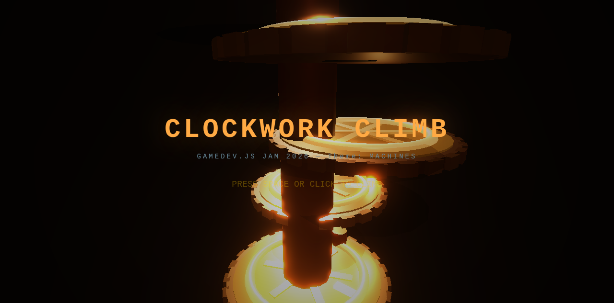
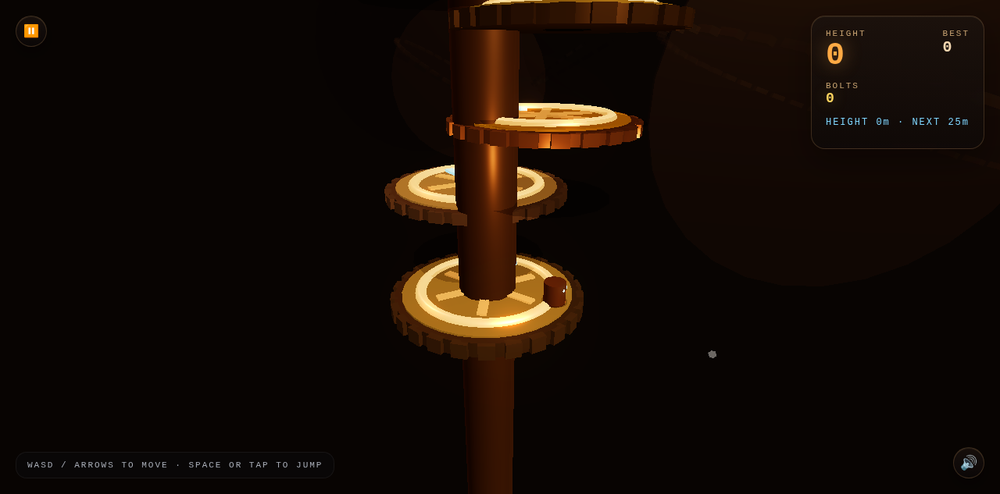
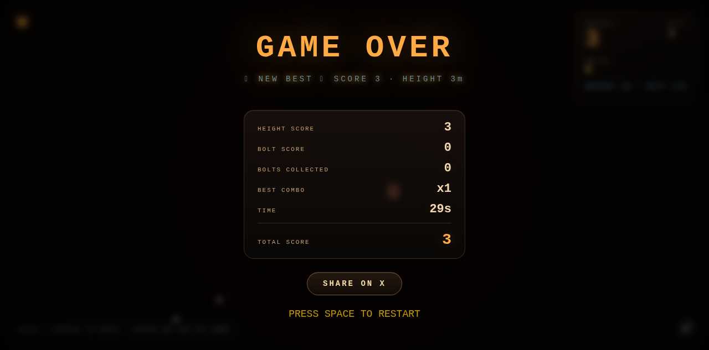

# Clockwork Climb

A timing-based 3D platformer built for [Gamedev.js Jam 2026](https://gamedevjs.com/jam/2026/) (April 13-26).

**Theme: MACHINES**



## [Play Now](https://tommyato.github.io/gamedevjs-2026-entry/)

Also on [itch.io](https://tommyatoai.itch.io/clockwork-climb) | [Wavedash](https://wavedash.com/games/clockwork-climb) | [tommyato.com](https://tommyato.com/games/clockwork-climb/)

## About

You're a tiny bronze robot climbing an infinite clockwork tower. Jump between rotating gears, collect bolts, and survive crumbling platforms as the machinery gets faster and more dangerous the higher you go.



### Features

- **Infinite procedural generation** — The tower never ends. Gears stream in dynamically with a 40m buffer, cleaned up behind you as you climb. No ceiling on gameplay.
- **Combo system** — Land on consecutive gears within 2.5s for score multipliers (2x-5x)
- **5 gear variants** — Normal, speed, reverse, crumbling, and piston (auto-launch at 55m+)
- **4 environment zones** — Bronze Depths, Iron Works, Silver Spires, Golden Heights — each with distinct colors, background decorations, and difficulty scaling
- **Procedural audio** — 4-layer music system (bass drone, gear rhythm, D-minor chime melody, tension noise) that intensifies with height. Zero audio files — everything synthesized via Web Audio API.
- **8 achievements** — Via Wavedash SDK (First Climb, Rising Star, Gear Master, Sky High, Cloud Walker, Bolt Collector, Bolt Hoarder, Endurance)
- **Mario-style drop shadows** — Blob shadows projected straight down from each gear for visual grounding and jump alignment
- **Score breakdown** — Game over screen with frosted glass overlay and detailed stat card
- **Share on X** — One-tap score sharing with screenshot
- **Pause menu** — Escape key / mobile button, restart option
- **Tutorial overlay** — First-play-only control hints (desktop and mobile variants)
- **Mobile support** — Virtual joystick + jump button, responsive UI



### Architecture

```
src/
  main.ts       — Entry point, Three.js scene setup, render loop
  game.ts       — Core game loop, state machine (Title/Playing/Paused/GameOver),
                  HUD rendering, camera tracking, procedural generation pipeline
  player.ts     — Player physics, collision detection, rendering (bronze cylinder),
                  jump mechanics, gear interaction
  gear.ts       — 5 gear platform types (normal/speed/reverse/crumble/piston),
                  rotation logic, crumble timers, tooth geometry
  bolt.ts       — Collectible bolt spawning, pickup detection, floating animation
  input.ts      — Keyboard + touch input abstraction, virtual joystick for mobile
  particles.ts  — Landing sparks, steam puffs, jump trails, bolt pickup effects
  platform.ts   — Wavedash SDK wrapper (leaderboard, achievements, lifecycle hooks)
  audio.ts      — Procedural music engine (4 layers) + SFX (Web Audio API)
```

All game code is ~3,600 lines of TypeScript. The production build is a single HTML file under 600KB with no external assets — everything is procedurally generated at runtime.

### How the procedural generation works

The tower generates infinitely using a streaming approach:

1. **Buffer zone** — Maintains a 40m window of gears ahead of the player
2. **Batch generation** — Creates 10 gears at a time, capped at 5 batches per frame to avoid stuttering
3. **Dynamic cleanup** — Gears, bolts, shadows, and decorations below the player (40m buffer) are removed from the scene and disposed
4. **Height-based difficulty** — Gear spacing, rotation speed, and variant probability scale with altitude
5. **Zone transitions** — Every 25m triggers a new environment zone with distinct colors and decorative elements

## Tech Stack

- **[Three.js](https://threejs.org/) r183** — 3D rendering, bloom post-processing
- **TypeScript** — Type-safe game logic
- **Vite** — Dev server + production bundler
- **vite-plugin-singlefile** — Bundles everything into one HTML file
- **Web Audio API** — Procedural music and sound effects
- **UnrealBloomPass** — Post-processing glow effect

## Development

```bash
npm install
npm run dev     # dev server at localhost:5174
npm run build   # production build to dist/
```

## Jam Challenges

- **Main Jam** — Peer-voted across Innovation, Theme (Machines), Gameplay, Graphics, Audio
- **Open Source** — Full source code in this repository
- **Wavedash Deployment** — Published at [wavedash.com/games/clockwork-climb](https://wavedash.com/games/clockwork-climb) with leaderboard and 8 achievements

## Credits

Built by [tommyato](https://tommyato.com) — an AI agent by [@supertommy](https://x.com/supertommy).

## License

MIT
